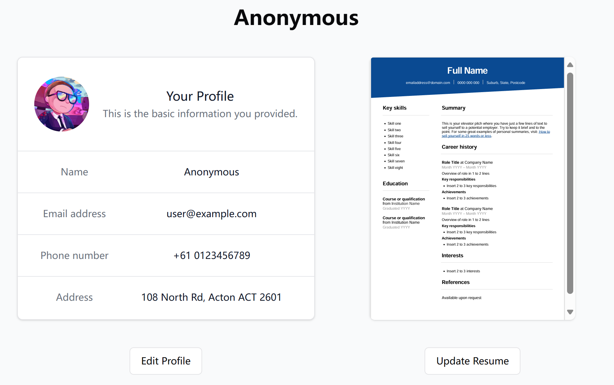
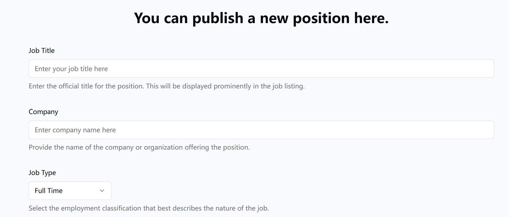
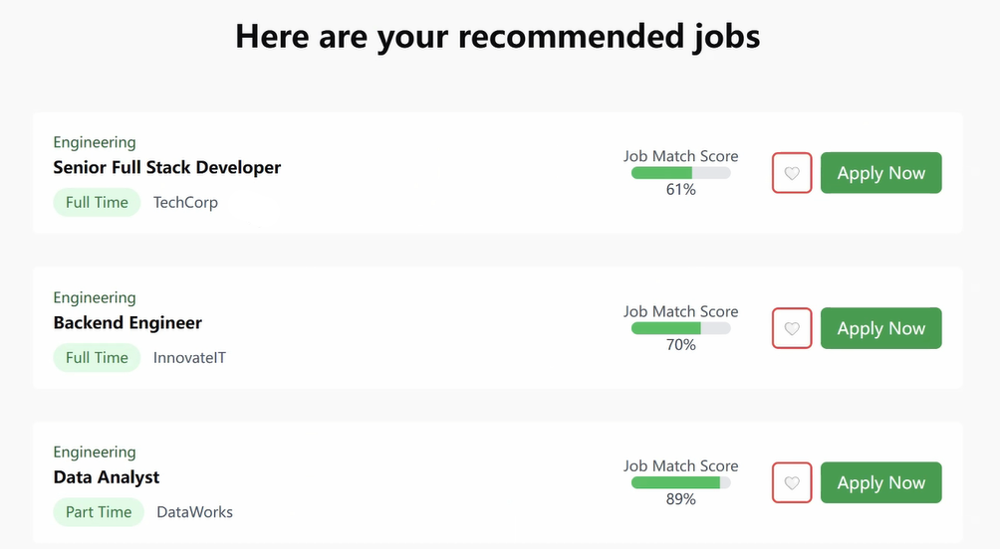
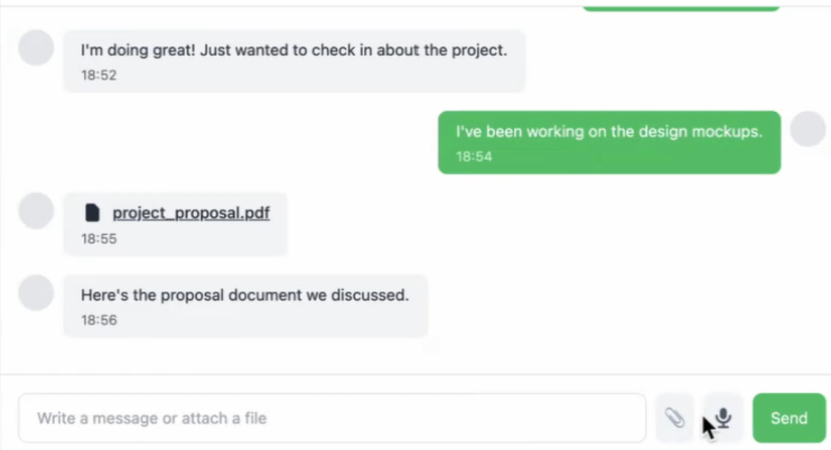
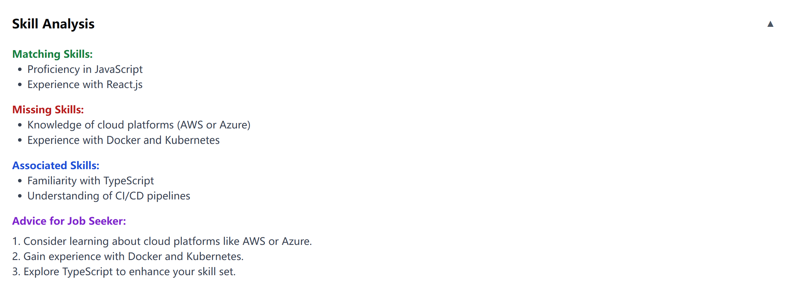

# Career Match

## Description

**Career Match** is a revolutionary job search information service platform that matches job seekers based on their talents and preferences. Users only need to build a profile, including their CV, salary expectations, and career goals, to receive job listings tailored to their skills and aspirations.

From a technological perspective, Career Match utilizes **machine learning** and **natural language processing (NLP)** to filter job applicants' information by keywords, ensuring the best candidates are matched with open positions.

This platform is built on **AWS Cloud** infrastructure, incorporating an **end-to-end data pipeline**, **data warehouse**, and **data lake** to efficiently store, process, and analyze job and applicant data. The system is designed for scalability and high availability, ensuring seamless job matching and recommendation processes.

## Presentation & Landing Page

- View the official **Canva slides**: [Presentation](https://www.canva.com/design/DAGeslzAspM/7_6c2asRIXdfvrKGOuL54w/edit?utm_content=DAGeslzAspM&utm_campaign=designshare&utm_medium=link2&utm_source=sharebutton).
- Explore the **Landing Page**: [Career Match Website](https://kendallan27.my.canva.site/)

## Features

### 1. User Authentication

- **Recruiter Login and Registration**: Users can create accounts, register and log in.

  


### 2. Profile Management

- **Candidate Profile**: Job seekers can create and edit their profiles and upload resumes.

  
  
- **Resume Parsing**: Automated extraction of skills and experiences from uploaded resumes.


### 3. Job Posting, Application, and Recommendations

- **Job Listings**: Recruiters can post job openings with detailed descriptions, company, and job type.

  

- **Personalized Job Recommendations**: The system recommends jobs based on a candidate's profile, resume, and preferences, allowing job seekers to like or save jobs for later. It also shows a match score for each job.

  
  

### 4. Messaging System

- **Real-time Communication**: Integrated messaging system allowing direct communication between candidates and recruiters.

  

### 5. Skill Analysis and Upskilling Recommendations

- **Skill Analysis**: Identifies matching skills from the candidate’s resume, highlights missing skills for better job opportunities, suggests related skills.
- **Personalized Recommendations**: Offers career advice and suggests courses or certifications to enhance candidate profiles.

  

### 6. Networking Features （Under Developing）

- **Peer-to-Peer Connections**: Allows users to connect with peers, mentors, and industry professionals to expand their professional network.

### 7. Career Path Prediction (Under Developing)

- **Career Trajectory Forecasting**: Predicts potential career paths by analyzing past job transitions and recommending optimal job movements using advanced modeling techniques.


## Project Startup Guide

### A. Initial Setup & Starting the Project

#### 1. Clone the repository

```bash
 git clone https://github.com/kunan-au/careermatch25s1.git
```

#### 2. Open the project in VS Code

```bash
 cd careermatch25s1
 code .
```

#### 3. Start Docker
Ensure **Docker Desktop** is running.

#### 4. Set up and start the backend

```bash
 cd server
 cp .env.example .env
 docker network create app_main
 docker-compose up -d --build
```

Once complete, you should see three new containers in Docker: **app**, **app_db**, and **app_redis**.

#### 5. Start all three containers manually in Docker if necessary.

> **Windows users:** If the `app` container does not start, refer to [Issues & Troubleshooting](#d-issues-you-may-face).

#### 6. Set up and start the frontend

```bash
 cd client
 npm install  # Install dependencies
 npm run dev  # Start the development server
```

You should see output similar to:

```
 career-match@0.0.0 dev
 vite
 ➜ Local:   http://localhost:5173/
 ➜ Network: use --host to expose
 ➜ Press h + enter to show help
```

#### 7. Open the project in a browser
Copy and paste `http://localhost:5173/` into your browser to access the platform.

---

### B. Running the Project (After Setup)

1. Open the `career-match-vite-fastapi` folder in **VS Code**.
2. Open **Docker Desktop** and start all three containers.
3. Open a **new terminal** in VS Code and start the frontend:

```bash
 cd client
 npm install  
 npm run dev
```

4. Open `http://localhost:5173/` in a browser.

---

### C. Navigating the Interface

#### 1. **Login is required to access features**
Sign up first, then log in.

**Example credentials:**

- **Email:** `user@example.com`
- **Password:** `CareerMatch1234!`

#### 2. **Switching pages**
Routes are defined in `client/src/router.tsx`.
For example, to view the user profile page:

```
 http://localhost:5173/profile
```

#### 3. **Shutting down the project**
Press **Ctrl + C** in the terminal:

```
^C Terminate batch job (Y/N)? 
```

Press `y` to confirm.

---

### D. Issues & Troubleshooting

#### 1. **Containers fail to start on Windows**

Try the following steps:

1. Delete the `career-match-vite-fastapi` folder.
2. Open **Command Prompt** and navigate to your desired directory.
3. Clone the project with the correct line ending settings:

```bash
 git config --global core.autocrlf input 
 git clone https://github.com/kunan-au/careermatch25s1.git
```

4. Open **Docker Desktop**.
5. Open **VS Code** and redo the **first setup**.
6. Check **Docker** to verify all containers are running.

#### 2. **npm installation issues**
Check if you have permission to access the `client` folder.

#### 3. **Login/Signup fails**
If you see this error:

```
Something went wrong connecting to the server. Please try again later.
```

Try applying database migrations:

```bash
 cd server
 docker-compose run app alembic upgrade head
 docker-compose down
 docker-compose up -d --build
```

Then restart the frontend:

```bash
 cd client
 npm run dev
```
