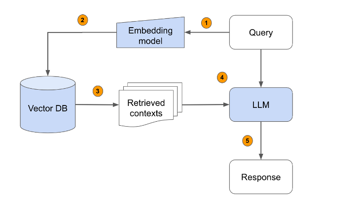

## Description

The core of our project involves the RAG system, which automatically retrieves information relevant to the given query—in this case, the job description. The RAG system first indexes all the processed data from the resumes. When a job description is entered, the system retrieves the most relevant resumes by matching the skills and experiences listed in the job description against our indexed database. The retrieved data then guides the generation module of RAG, which synthesizes this information to rank the resumes according to their match quality.

This method enhances the traditional keyword-based search by adding a layer of context understanding, which significantly improves the matching accuracy. It allows the system to understand the nuances of job requirements and candidate profiles beyond mere keyword matching.

## How RAG Works

### Retrieval System
**Data Sources:** Utilizes pre-built knowledge bases, such as resume databases and job description libraries, established through text mining and data organization.

**Retrieval Techniques:** Employs efficient vector retrieval algorithms (such as FAISS or Pinecone) to index and retrieve documents from the database that are most relevant to the input query.

### Generation Model
**Model Selection:** Based on pretrained language models like GPT-3, known for their powerful text generation capabilities.

**Generation Logic:** The model generates detailed and relevant outputs based on the information retrieved and the original query.

### Workflow

1. User inputs a query.
2. Use an embedding model to convert the query into a vector representation.
3. Use the vector representation of the query to retrieve relevant information from the vector database (Vector DB).
4. Input the retrieved contexts from the vector database along with the original query into a large language model (LLM).

## Limitation

### Adaptability and Flexibility
One challenge our resume matching system faces is adapting to rapidly changing industry demands and job descriptions. As new technologies emerge and career roles evolve, our system must continuously update its data indexing and matching algorithms to ensure it can recognize and respond to these changes. We plan to enhance the adaptability of our algorithms through periodic system assessments and updates, ensuring the accuracy and relevance of our match results.

### Privacy and Security Concerns
Our system places a high priority on the privacy and security of the extensive resume data we handle and store. We employ advanced encryption techniques and strict data access controls to ensure the security of all candidate information. Additionally, we adhere to the strictest data protection regulations to safeguard user privacy and data security, preventing data breaches and misuse.

### Bias and Fairness
To prevent the system from replicating existing recruitment biases, we utilize de-biasing algorithms and continuous system reviews. Our goal is to reduce unfair practices in the candidate selection process through technological means, ensuring each candidate is evaluated fairly. Moreover, we regularly review our training datasets to remove any factors that might introduce bias, maintaining the fairness and effectiveness of our system.

## Link: https://drive.google.com/drive/folders/1F9hGkdWDE7Zopju33zyKOBr1CbYeAIaf
